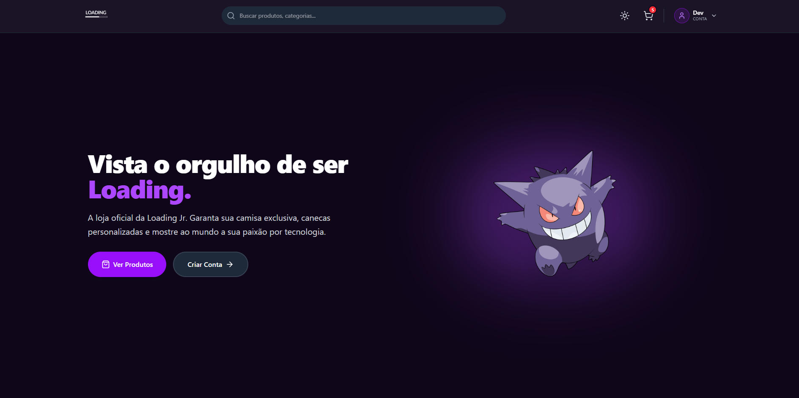
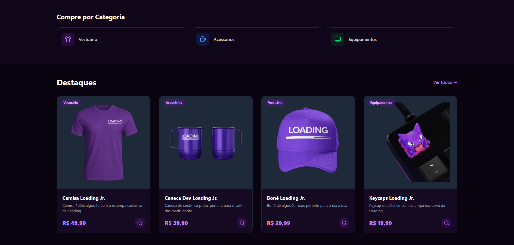
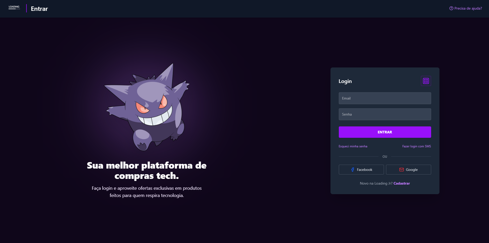
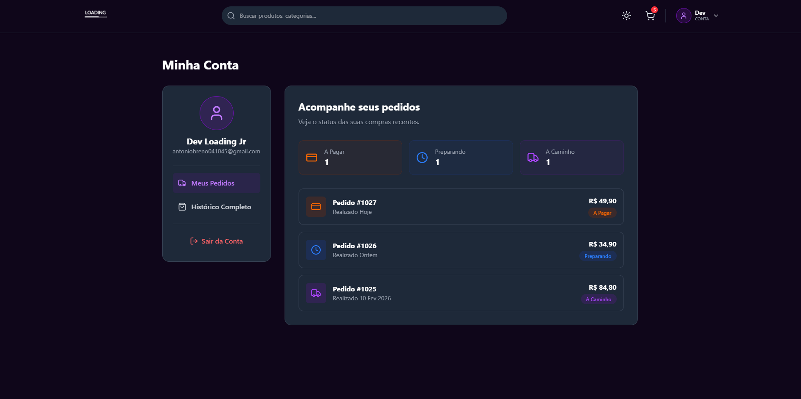
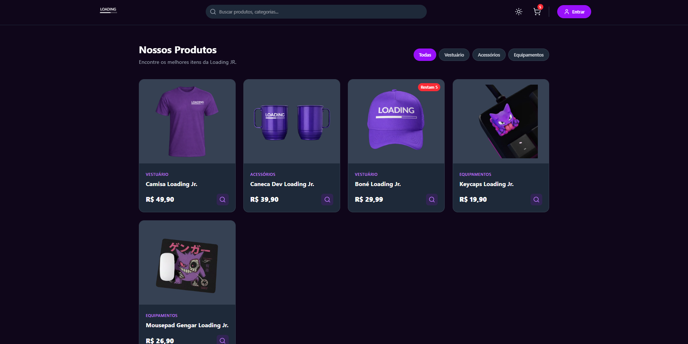
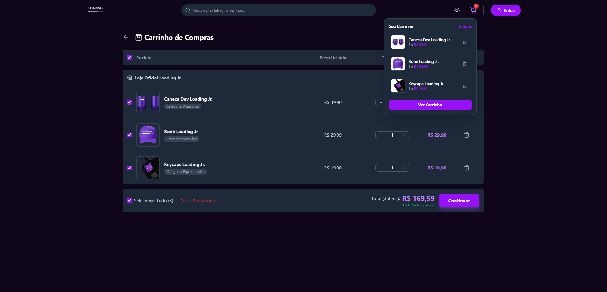

# 💜 Loading Store – E-Commerce Platform


Projeto Frontend desenvolvido como desafio prático para o **Processo Seletivo 2026.1 da Loading Jr**.
O objetivo foi construir uma interface de e-commerce completa, moderna e altamente funcional, priorizando:

- Organização e abstração de código
- Responsividade total (mobile-first)
- Experiência do usuário (UX)
- Preparação para integração com back-end real

---

## 📸 Telas do Sistema

| Home & Dark Mode | Produtos & Filtros |
| :---: | :---: |
|  |  |

| Autenticação (Login / Registro) | Perfil do Usuário |
| :---: | :---: |
|  |  |

| Modal de Produto | Carrinho | Checkout |
| :---: | :---: | :---: |
|  |  |  |

---

## ✨ Funcionalidades Implementadas

O projeto atende aos requisitos obrigatórios e bônus definidos no processo seletivo:

- **🏠 Home**
  - Banners de destaque
  - Produtos em alta
  - Navegação rápida por categorias

- **🛍️ Listagem Dinâmica de Produtos**
  - Busca por texto
  - Filtro por categorias
  - Estado sincronizado via URL

- **📦 Visualização de Produto**
  - Modal e página dedicada
  - Informações detalhadas (preço, descrição, estoque)

- **🔐 Autenticação**
  - Login e Registro
  - Fluxo otimizado para conversão
  - Layout inspirado em grandes plataformas de e-commerce

- **👤 Perfil do Usuário**
  - Visualização de pedidos ativos
  - Histórico de compras
  - Status visuais:
    - A Pagar
    - Preparando
    - A Caminho
    - Entregue

- **🛒 Carrinho & Checkout (Extra)**
  - Adição e remoção de produtos
  - Cálculo de valores
  - Simulação de checkout completo

---

## 🌟 Diferenciais (Bônus)

- **🌗 Dark / Light Mode Nativo**
  - Gerenciado via Tailwind CSS v4 + Context API
  - Preferência de tema salva no dispositivo

- **💾 Persistência de Dados**
  - Sessão do usuário
  - Tema selecionado
  - Itens do carrinho
  - Tudo mantido via `localStorage`

---

## 🛠️ Tecnologias Utilizadas

A stack foi escolhida visando escalabilidade, tipagem forte e fácil manutenção:

- **React.js** (Vite)
- **TypeScript**
- **Tailwind CSS v4**
- **React Router DOM**
- **Context API**
  - Autenticação
  - Carrinho
  - Tema (Dark/Light)
- **Lucide React** (Ícones)

---

## 🏗️ Arquitetura e Abstração de Dados

Um dos principais focos do projeto foi preparar o Frontend para integração futura com um back-end real.

- Dados desacoplados dos componentes de UI
- Consumo centralizado via `services/api.ts`
- Tipagem forte definida em `src/types/`
- Mock de dados estruturado para fácil substituição por API real

---

## 📄 Documentação da Mock API

### 🧩 Entidade: Produto (`Product`)

| Campo | Tipo | Descrição |
| :--- | :--- | :--- |
| `id` | `string` | Identificador único do produto |
| `name` | `string` | Nome do produto |
| `description` | `string` | Descrição detalhada |
| `price` | `number` | Preço unitário |
| `category` | `string` | Categoria do produto |
| `images` | `string[]` | Lista de imagens |
| `stock` | `number` | Quantidade disponível |

---

### 📦 Entidade: Pedido (`Order`)

| Campo | Tipo | Descrição |
| :--- | :--- | :--- |
| `id` | `string` | Código do pedido (ex: `#1027`) |
| `userId` | `string` | ID do usuário |
| `date` | `string` | Data do pedido |
| `total` | `string` | Valor total formatado |
| `status` | `string` | Status do pedido |
| `isActive` | `boolean` | Pedido ativo ou finalizado |

---

## 🚀 Como executar o projeto localmente

### 1️⃣ Clone o repositório
```bash
git clone https://github.com/SEU_USUARIO/NOME_DO_REPOSITORIO.git

2️⃣ Acesse a pasta do projeto
cd NOME_DO_REPOSITORIO

3️⃣ Instale as dependências
npm install

4️⃣ Inicie o servidor de desenvolvimento
npm run dev

5️⃣ Acesse no navegador
http://localhost:5173